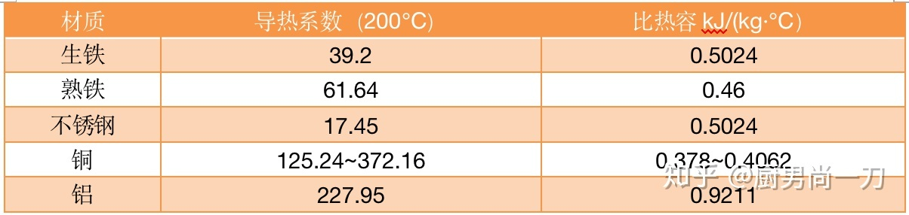

# 锅

## 材质

先盗一张图。

### 熟铁

薄皮熟铁炒锅，炒锅中的yyds，中式爆炒的唯一选择。

### 生铁

铸铁煎锅，可进烤箱，代表品牌lodge。

珐琅铸铁锅，可无水焗，代表品牌staub。

### 不绣钢

不绣钢漂亮，当蒸煮锅或者煎锅都行。但导热系数巨差，非颜狗很难拿它来煎炒。

不绣钢锅其实温度上去后也不太粘的，要做温度和时间的朋友，耐心一点，反正锅烧不坏。

### 铝

虽然80年代很多铝锅，但铝现在不直接拿来做锅了，因为有毒。

可是它又便宜，导热又好，储热还强，简直是天生为锅而生。怎么办呢？

答案：用来做夹层。只要不直接接触食物就没事了嘛。

选这种锅要注意锅的使用寿命。

### 涂层

涂层锅可以用，正常使用没啥毒性。但要牢记它是个消耗品。

涂层化学性质巨稳定，魔抗逆天，但物抗低。一怕硬物，二怕高温。

所以涂层锅不要配金属铲子，也不要用来爆炒。但即使做到好好保护，也建议两年一换，反正不贵。

## 开锅

只有铁锅需要开锅，原理就是镀油膜，一层两层三层的镀上去。
